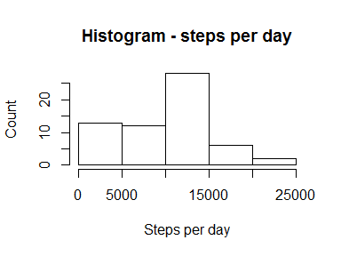
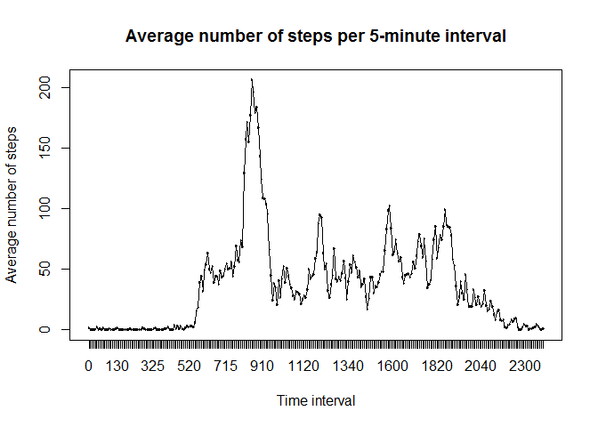
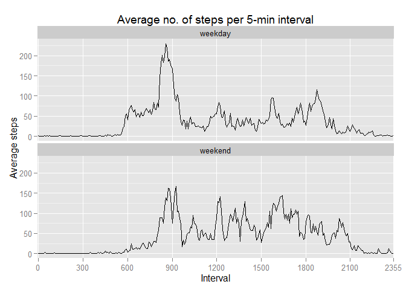

# Reproducible Research: Peer Assessment 1

## Loading and preprocessing the data

First step, unzip the data file

```r
unzip("activity.zip", setTimes=TRUE)
```

Read the data into a dataframe named **activity**

```r
activity <- read.csv("activity.csv", stringsAsFactors=FALSE)
```

Load the dplyr library

```r
library(dplyr)
```

```
## Warning: package 'dplyr' was built under R version 3.2.2
```

```
## 
## Attaching package: 'dplyr'
## 
## The following objects are masked from 'package:stats':
## 
##     filter, lag
## 
## The following objects are masked from 'package:base':
## 
##     intersect, setdiff, setequal, union
```

## What is mean total number of steps taken per day?

Create a date factor, summarise into a new data frame

```r
activity$date_f <- as.factor(activity$date)

steps_per_day <- summarise(group_by(activity, date_f), 
                           totalsteps = sum(steps, na.rm=TRUE))
```

### Make a histogram of the total number of steps taken each day

```r
hist(steps_per_day$totalsteps, 
           main="Histogram - steps per day",
           xlab="Steps per day",
           ylab = "Count")
```




### Calculate and report the mean and median total number of steps taken per day
#### Calculate mean and median

```r
mean_steps_per_day = mean(steps_per_day$totalsteps)
median_steps_per_day = median(steps_per_day$totalsteps)
```

The **mean** number of steps per day = 9354.2295082  
The **median** number of steps per day = 10395


## What is the average daily activity pattern?

Summarize the data for all days by grouping by the interval

```r
# create a 5-min interval factor
activity$interval_f <- as.factor(activity$interval)

interval_avg_df <- summarise(group_by(activity, interval_f),
                             avg_steps = mean(steps, na.rm=TRUE))

plot(interval_avg_df$interval_f, interval_avg_df$avg_steps, main="Average number of steps per 5-minute interval", xlab="Time interval", ylab="Average number of steps")
lines(interval_avg_df$interval_f, interval_avg_df$avg_steps, type="l")
```



Find the index where the maximum occurs

```r
index_max <- which.max(interval_avg_df$avg_steps)
interval_at_max <- levels(interval_avg_df$interval_f)[index_max]
max_avg_steps <- interval_avg_df$avg_steps[index_max]
```

The maximum number of average steps in a 5-minute interval is **206.1698113** and occurs at interval **835**.


## Imputing missing values

### Determine what's missing 


```r
total_rows <- nrow(activity)
missing_steps <- sum(is.na(activity$steps))
missing_date <- sum(is.na(activity$date))
missing_interval <- sum(is.na(activity$interval))
```

Total number of rows of data = 17568  
Number of missing values of variable **steps** = 2304  
Number of missing values of variable **date** = 0  
Number of missing values of variable **interval** = 0  


### To fill in missing values, will use the average value for the 5-minute interval

#### Create a new data frame **new_act** that has the missing values filled in

```r
# get the indices (into the 'activity' df) that have NAs
indices_nas <- which(is.na(activity$steps))

# get the corresponding intervals
intervals_with_nas <- activity$interval[indices_nas]

# find the positions in the avg_steps table for these intervals
pos_avg_steps_df <- match(intervals_with_nas, interval_avg_df$interval_f)

# get the corresponding average values for these intervals
values_pos_avg_steps_df <- interval_avg_df$avg_steps[pos_avg_steps_df]

# Create a new dataset that is equal to the original 
#  dataset but with the missing data filled in.

# copy the original 'activity' df to 'new_act'
new_act <- activity
# create a new column instead of overwriting the old one
new_act$new_steps <- new_act$steps
# in this new column, write in the averages for the intervals
new_act$new_steps[indices_nas] <- values_pos_avg_steps_df
```

#### verify there are no NAs in the new data

```r
num_nas_new <- sum(is.na(new_act$new_steps))
```
The number of missing values in the new data: 0

### Now making a histogram of the new, filled-in dataset

```r
# Make a histogram of the total number of steps taken 
#  each day and Calculate and report the mean and median 
#  total number of steps taken per day. 

new_steps_per_day <- summarise(group_by(new_act, date_f), 
                           totalsteps = sum(new_steps, na.rm=TRUE))

# plot a histogram
hist(new_steps_per_day$totalsteps, 
           main="With new Filled-In data: Histogram of steps per day",
           xlab="Steps per day",
           ylab = "Count")
```


### Calculating mean and median for the new dataset


```r
# calculate mean and median
mean_new_steps_per_day = mean(new_steps_per_day$totalsteps)
median_new_steps_per_day = median(new_steps_per_day$totalsteps)
```

The new **mean** number of steps per day = **1.0766189\times 10^{4}**  
The new **median** number of steps per day = **1.0766189\times 10^{4}**

###  Do these values differ from the estimates from the first part of the assignment? 


```r
# calculate the differences and present the old and
#  the new data and the change
change_in_mean <- mean_new_steps_per_day - mean_steps_per_day
percent_change_in_mean = 100 * (change_in_mean / mean_steps_per_day)
change_in_median <- median_new_steps_per_day - median_steps_per_day
percent_change_in_median = 100 * (change_in_median / median_steps_per_day)
```

### Impact:  
* The **mean** increased by **1411.959171** (15.0943396%)
* The **median** increased by **371.1886792** (3.5708387%)

### What is the impact of imputing missing data on the estimates of the total daily number of steps?

**Answer:**
The impact of imputing missing data on the estimates is that the estimates went up.  
This is not surprising given that the missing data was essentially counted as 0

## Are there differences in activity patterns between weekdays and weekends?


```r
# add a column containing the day of the week
new_act$day_of_week <- weekdays(as.Date(new_act$date), abbreviate=TRUE)
# add a column containing "weekend" or "weekday"
new_act$day_type <- as.factor(ifelse((new_act$day_of_week == "Sun") 
                                     | (new_act$day_of_week == "Sat"),
                                     "weekend", "weekday"))

# Make a panel plot containing a time series plot (i.e. type = "l") 
#  of the 5-minute interval (x-axis) and the average number 
#  of steps taken, averaged across all weekday days or 
#  weekend days (y-axis). 
# See the README file in the GitHub repository to see an 
# example of what this plot should look like using simulated data.

# create a dataframe summarizing by 5-minute interval

library(ggplot2)
```

```
## Warning: package 'ggplot2' was built under R version 3.2.2
```

```r
new_interval_avg_df <- summarise(group_by(new_act, interval_f, day_type), 
                             avg_steps = mean(new_steps, na.rm=TRUE))


print(ggplot(new_interval_avg_df, aes(x=interval_f,y=avg_steps, group=1)) 
      + geom_line() 
      + facet_wrap(~ day_type, ncol=1)
      + labs(title="Average no. of steps per 5-min interval", x="Interval", y="Average steps")
      + scale_x_discrete(breaks=c(0, 300, 600, 900, 1200, 1500, 1800, 2100, 2355)))
```


      


